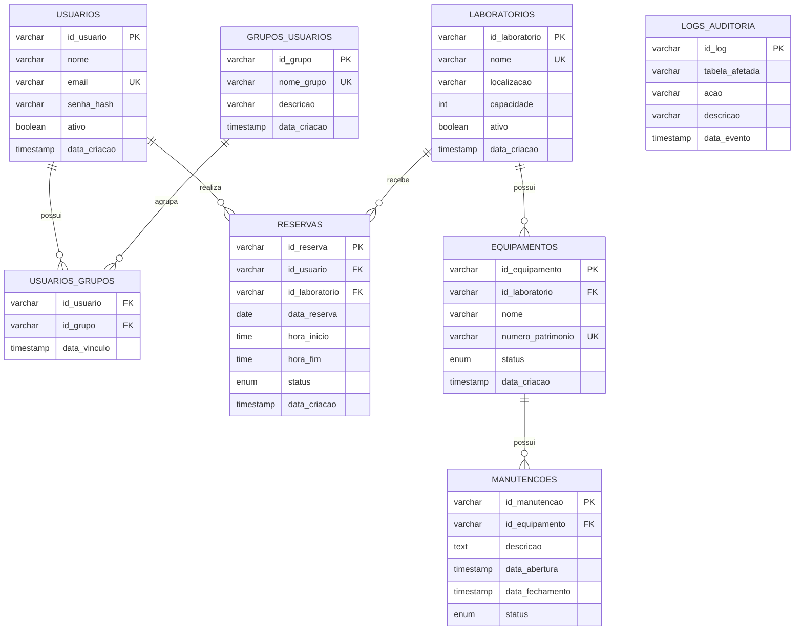

# Diagrama Entidade-Relacionamento - NEXUS Lab

```mermaid
erDiagram
    USUARIOS ||--o{ USUARIOS_GRUPOS : possui
    GRUPOS_USUARIOS ||--o{ USUARIOS_GRUPOS : agrupa
    USUARIOS ||--o{ RESERVAS : realiza
    LABORATORIOS ||--o{ RESERVAS : recebe
    LABORATORIOS ||--o{ EQUIPAMENTOS : possui
    EQUIPAMENTOS ||--o{ MANUTENCOES : possui

    USUARIOS {
        varchar id_usuario PK
        varchar nome
        varchar email UK
        varchar senha_hash
        boolean ativo
        timestamp data_criacao
    }

    GRUPOS_USUARIOS {
        varchar id_grupo PK
        varchar nome_grupo UK
        varchar descricao
        timestamp data_criacao
    }

    USUARIOS_GRUPOS {
        varchar id_usuario FK
        varchar id_grupo FK
        timestamp data_vinculo
    }

    LABORATORIOS {
        varchar id_laboratorio PK
        varchar nome UK
        varchar localizacao
        int capacidade
        boolean ativo
        timestamp data_criacao
    }

    EQUIPAMENTOS {
        varchar id_equipamento PK
        varchar id_laboratorio FK
        varchar nome
        varchar numero_patrimonio UK
        enum status
        timestamp data_criacao
    }

    RESERVAS {
        varchar id_reserva PK
        varchar id_usuario FK
        varchar id_laboratorio FK
        date data_reserva
        time hora_inicio
        time hora_fim
        enum status
        timestamp data_criacao
    }

    MANUTENCOES {
        varchar id_manutencao PK
        varchar id_equipamento FK
        text descricao
        timestamp data_abertura
        timestamp data_fechamento
        enum status
    }

    LOGS_AUDITORIA {
        varchar id_log PK
        varchar tabela_afetada
        varchar acao
        varchar descricao
        timestamp data_evento
    }
```
